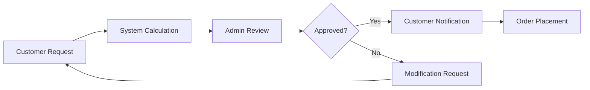
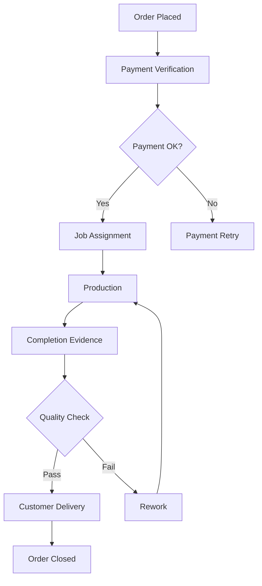

# ArtSign - Project Overview

## 🎯 Executive Summary

ArtSign is a comprehensive custom manufacturing order management system designed to revolutionize how signage and printing businesses operate. The platform streamlines the entire order lifecycle from quotation to delivery, connecting customers, business owners, and contractors in a seamless digital ecosystem.

### Vision

To become the leading digital platform for custom manufacturing businesses, enabling 10x growth without proportional staffing increases.

### Mission

Automate complex business processes while maintaining quality control and customer satisfaction through intelligent workflow management.

## 🏗️ System Architecture

### Application Structure

```
ArtSign Platform
├── Frontend Applications
│   ├── app-web (Customer E-commerce Portal)
│   ├── app-admin (Administrative Dashboard)
│   └── app-mobile (Mobile App - Future)
├── Backend Services
│   └── app-be (Express.js API)
├── Shared Resources
│   └── packages/shared-types (TypeScript Definitions)
└── Legacy Systems (To be migrated)
    ├── artSign-admin
    └── artSign-customer
```

### Technology Stack

| Layer              | Technology                   | Purpose                  |
| ------------------ | ---------------------------- | ------------------------ |
| **Frontend**       | Next.js 15.x, React 19.x     | Web applications         |
| **Backend**        | Express.js 4.x, Node.js 20.x | API services             |
| **Database**       | PostgreSQL 15.x              | Primary data store       |
| **Cache**          | Redis 7.x                    | Performance optimization |
| **ORM**            | Prisma                       | Database abstraction     |
| **Authentication** | JWT                          | Secure access control    |
| **Real-time**      | Socket.io                    | Live updates             |
| **File Storage**   | AWS S3                       | Document/image storage   |

## 👥 User Personas

### 1. Customer Organization

#### Customer Admin

- **Access**: Full company account control
- **Responsibilities**: User management, financial oversight, strategic ordering
- **Key Features**: Department management, credit limit control, reporting

#### Department User

- **Access**: Department-specific orders
- **Responsibilities**: Create quotations, place orders, track deliveries
- **Key Features**: Order creation, status tracking, communication

#### Viewer

- **Access**: Read-only
- **Responsibilities**: Monitor order status, view reports
- **Key Features**: Dashboard viewing, report access

### 2. Internal Team

#### Super Admin (Eric - Business Owner)

- **Access**: Complete system control
- **Responsibilities**: Strategic decisions, pricing management, contractor oversight
- **Key Features**: All system features, configuration management

#### Admin Staff

- **Access**: Operational management
- **Responsibilities**: Order processing, quality control, customer support
- **Key Features**: Order management, contractor assignment, quality review

### 3. Contractors

#### Lead Contractor

- **Access**: Job management and delegation
- **Responsibilities**: Accept jobs, manage sub-contractors, submit completion evidence
- **Key Features**: Job dashboard, sub-job assignment, invoice submission

#### Standard Contractor

- **Access**: Assigned jobs only
- **Responsibilities**: Execute assigned work, submit completion evidence
- **Key Features**: Job view, evidence upload, status updates

## 🔄 Core Workflows

### 1. Quotation Workflow



### 2. Order Fulfillment Workflow



## 💰 Pricing Engine

### Formula Types

#### Area-Based (2D Products)

```
Base Price = Width × Length × Material Rate per SQF
If Area ≥ 50 SQF: Apply 30% discount
Final Price = Base Price + Add-ons
```

#### Volume-Based (3D Products)

```
Base Price = Width × Length × Height × Material Rate per Cubic Foot
If Volume ≥ Threshold: Apply bulk discount
Final Price = Base Price + Add-ons
```

### Add-on Services

- Fixed price add-ons (e.g., $50 for express service)
- Percentage-based add-ons (e.g., 10% for premium finish)
- Area-based add-ons (e.g., $2/SQF for lamination)

## 📊 Key Features

### Customer Portal (app-web)

| Feature Category       | Key Capabilities                                        |
| ---------------------- | ------------------------------------------------------- |
| **Account Management** | Multi-department support, User roles, Credit management |
| **Product Catalog**    | Category browsing, Material selection, Visual previews  |
| **Quotation System**   | Real-time pricing, Draft saving, PDF generation         |
| **Order Management**   | Status tracking, Modification requests, History viewing |
| **Payment Processing** | Multiple methods, Down payments, Invoice downloads      |
| **Communication**      | In-app messaging, Email notifications, Support tickets  |

### Admin Portal (app-admin)

| Feature Category          | Key Capabilities                                            |
| ------------------------- | ----------------------------------------------------------- |
| **Dashboard**             | Real-time metrics, Revenue tracking, Pipeline visualization |
| **Quotation Management**  | Approval workflow, Price adjustments, Bulk processing       |
| **Order Processing**      | Payment verification, Job assignment, Status updates        |
| **Contractor Management** | Performance tracking, Payment processing, Skill mapping     |
| **Quality Control**       | Evidence review, Rework assignment, Satisfaction tracking   |
| **Financial Management**  | Invoice generation, Reporting suite, Profitability analysis |

### Contractor Portal

| Feature Category   | Key Capabilities                                               |
| ------------------ | -------------------------------------------------------------- |
| **Job Management** | Assignment acceptance, Progress updates, Evidence upload       |
| **Financial**      | Invoice submission, Payment tracking, Earning reports          |
| **Communication**  | Issue reporting, Clarification requests, Availability calendar |

## 🎯 Success Metrics

### Operational Efficiency

- **Quotation Generation**: < 2 minutes (70% reduction)
- **Order Processing**: < 5 minutes per order
- **Payment Processing**: < 24 hours for contractors

### Quality Metrics

- **Order Accuracy**: > 98%
- **Customer Satisfaction**: > 4.5/5
- **Rework Rate**: < 2%

### Technical Performance

- **API Response Time**: < 300ms (95th percentile)
- **Page Load Time**: < 2 seconds
- **System Uptime**: > 99.9%
- **Concurrent Users**: 1,000+

### Business Growth

- **Order Volume Capacity**: 100,000/month
- **Revenue Processing**: $10M+/month
- **Contractor Network**: 500+ active

## 🔒 Security & Compliance

### Security Measures

- **Authentication**: JWT with refresh tokens
- **Encryption**: TLS 1.3 in transit, AES-256 at rest
- **Access Control**: Role-based permissions (RBAC)
- **Monitoring**: Real-time threat detection, SIEM integration

### Compliance

- **PCI DSS Level 1**: Payment card security
- **GDPR**: EU data protection
- **CCPA**: California privacy rights
- **SOC 2 Type II**: Security certification

## 🚀 Implementation Features

### Completed ✅
- User authentication and authorization
- Basic order management
- Quotation system
- Payment integration

### In Progress 🔄
- Contractor portal
- Quality control workflows
- Financial reporting
- Real-time updates

### Planned 📋
- Performance optimization
- Advanced analytics
- Mobile app development
- AI-powered pricing
- Multi-region deployment
- Enterprise features
- API marketplace
- White-label options

## 🔧 Development Guidelines

### Code Organization

#### Backend (app-be)
```
src/
├── app.ts              # Express app configuration
├── server.ts           # Server entry point
├── config/             # Configuration files
│   ├── jwt.ts         # JWT configuration
│   └── swagger.ts     # API documentation config
├── controllers/        # Request handlers
│   ├── auth/          # Authentication controllers
│   └── user/          # User management controllers
├── services/           # Business logic layer
│   ├── auth/          # Authentication services
│   └── user/          # User services
├── middleware/         # Express middleware
│   ├── auth/          # Auth middleware (authenticate, authorize)
│   ├── error/         # Error handling
│   └── validation/    # Request validation
│       └── schemas/   # Validation schemas
├── routes/             # API route definitions
│   └── api/
│       └── v1/        # Version 1 API routes
├── database/           # Database related
│   ├── client.ts      # Prisma client
│   └── seed.ts        # Database seeding
└── utils/              # Helper functions
    ├── auth.ts        # Auth utilities
    └── email.ts       # Email utilities
```

#### Frontend (app-web, app-admin)
```
src/
├── app/                # Next.js app directory
│   ├── (auth)/        # Authentication pages
│   ├── api/           # API routes
│   ├── layout.tsx     # Root layout
│   └── page.tsx       # Home page
├── contexts/           # React contexts
│   └── AuthContext.tsx # Authentication context
├── services/           # API client services
│   ├── api.ts         # Base API client
│   └── authService.ts # Auth API calls
└── middleware.ts       # Next.js middleware
```

#### Shared Types (packages/shared-types)
```
src/
├── index.ts            # Main export file
├── enums/              # Enum definitions
│   └── index.ts       # Role, Status enums
├── models/             # Database models
│   ├── user.ts        # User model
│   └── schema.prisma  # Prisma schema
└── types/              # TypeScript types
    ├── auth.ts        # Authentication types
    ├── common.ts      # Common/shared types
    ├── customer.ts    # Customer types
    ├── order.ts       # Order types
    ├── product.ts     # Product types
    ├── quotation.ts   # Quotation types
    ├── invoice.ts     # Invoice types
    └── refund.ts      # Refund types
```

### API Design Principles

- RESTful architecture
- Consistent naming conventions
- Comprehensive error handling
- Version control (v1, v2)
- OpenAPI 3.0 documentation

### Testing Strategy

- Unit tests: > 80% coverage
- Integration tests: All API endpoints
- E2E tests: Critical user journeys
- Performance tests: Load and stress testing

## 📚 Additional Resources

### Documentation

- [API Documentation](./docs/api/README.md)
- [Database Schema](./docs/database/schema.md)
- [Deployment Guide](./docs/deployment/README.md)
- [User Manuals](./docs/user-guides/)
